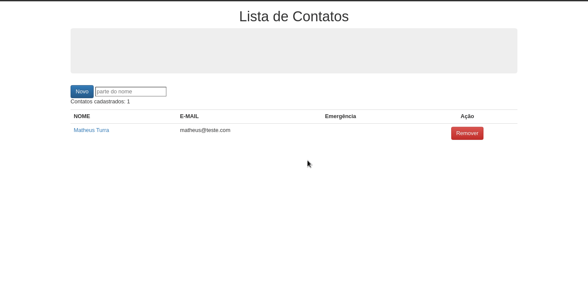

<h1 align="center">
    **Lista de Contatos**
</h1>

</br>
</br>

## :clipboard: Sobre

O projeto **Lista de Contatos** é um CRUD que foi criado com o Livro **[MEAN: FullStack Javascript](https://www.casadocodigo.com.br/products/livro-mean)** com intuito de colocar em prática tudo que aprendi durante sua leitura.

## :hammer:	Tecnologias utilizadas

O projeto foi desenvolvido utilizando as seguintes tecnologias

- [MongoDB](https://www.mongodb.com/)
- [AngularJS](https://angularjs.org/)
- [ExpressJS](https://expressjs.com/pt-br/)
- [Node.js](https://nodejs.org/en/)

<br>

## :computer: Como executar o projeto

### **Pré requisitos**
Antes de começar, você precisa ter instalado na sua maquina o [Node.js](https://nodejs.org/en/), e o **[MongoDB](https://docs.mongodb.com/manual/administration/install-community/)** rodando na porta **localhost:27017**

#### Rodando o MongoDB
```bash
    # Inicia o driver do mongodb
    $ sudo systemctl start mongod

    # Inicía o banco de dados mongodb 
    $ mongo 
```

#### Rodando a aplicação
```bash
    # Clonar o repositório
    $ git clone https://github.com/MatheusTurra/ListaDeContatos

    # Entrar no diretório
    $ cd ListaDeContatos/

    # Instala as dependências do projeto
    $ npm install

    # Inicia a aplicação
    $ npm run start
```

<hr>

<p align="center">
    Desenvolvido por Matheus Farisco Turra :nerd_face:
</p>